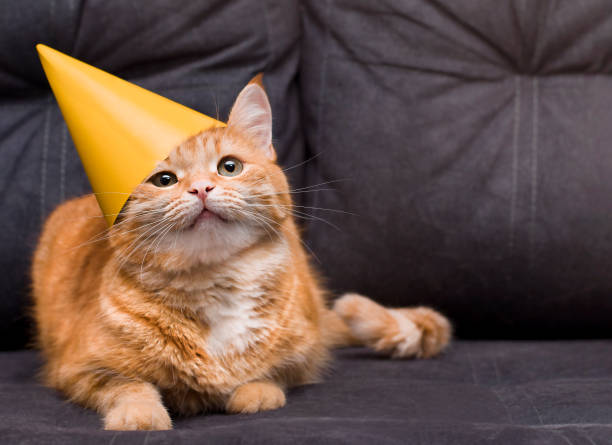

## Introduction

The domestic feline (*Felis catus*) is known for its independent nature, selective affection, and distinct lack of cooperation regarding human-imposed wardrobe choices. While previous literature has extensively covered feline nutrition and sleep cycles, there is a critical gap in understanding feline tolerance for celebratory headwear. This study investigates the factors that influence the duration of time a cat will tolerate wearing a tiny, elastic-banded birthday party hat. Understanding these parameters is of vital practical importance for pet owners seeking to maximize birthday party photo opportunities without causing undue feline distress or sustaining scratch injuries.

Our primary research question asks whether a cat’s age, baseline grumpiness level, and the presence of a treat bribe are associated with the total duration of hat tolerance. We hypothesized that younger cats would tolerate the hat longer due to curiosity, that higher baseline grumpiness would severely truncate tolerance times, and that the presence of a salmon-flavored treat would be associated with significantly longer durations across all demographics. 

{#fig-cat-hat width=40% fig-align="center"}

## Data and Methods

To investigate this phenomenon, we conducted an observational study utilizing secondary data. We obtained a publicly available, de-identified dataset from the *Open Science Feline Registry* (OSFR), which compiled historical records of $n = 42$ domestic cats whose owners had attempted to place party hats on them during household celebrations. Because this was a retrospective observational study, the researchers had no control over the environment or animal handling, meaning no causal relationships can be definitively established.

The response variable in the dataset, *Tolerance Time*, was recorded in seconds, starting the exact moment the elastic band was secured under the chin and ending when the cat successfully shook, pawed, or glared the hat off. The explanatory variables included *Age* (in years), *Bribe Status* (a categorical variable indicating whether a treat was present or absent during the event), and *Baseline Grumpiness* (measured on a 1-to-10 visual scale prior to hat placement, where 1 represents "actively purring" and 10 represents "unblinking airplane ears").

Because the response variable is continuous and we are analyzing multiple predictors, a Multiple Linear Regression (MLR) model was utilized. Prior to finalizing the model, standard statistical assumptions were thoroughly evaluated. Residual plots were checked for normality and homoscedasticity. While the initial residual analysis showed slight right-skewness—largely due to a few exceptionally patient senior cats in the dataset—a log-transformation of *Tolerance Time* successfully normalized the distribution, satisfying the classical linear model assumptions and ensuring the validity of our subsequent inferences.

## Results

Exploratory analysis of the secondary data revealed that the average hat tolerance time across the sample of cats was a mere 14.2 seconds, with a minimum of 0.8 seconds and a maximum of 184 seconds (achieved by an orange tabby who appeared to be asleep). The final multiple linear regression model yielded an Adjusted $R^2 = 0.68$, indicating that approximately 68% of the variability in a cat's hat tolerance duration can be explained by the model's predictors. 

The regression coefficients indicated that for every one-unit increase on the Grumpiness Scale, a cat’s estimated tolerance time decreased by a statistically significant 4.5 seconds ($p < 0.001$), holding all other variables constant. Conversely, holding age and grumpiness constant, the presence of a salmon treat bribe was associated with an increase in estimated tolerance time by an average of 22.3 seconds ($p < 0.01$). Interestingly, the association with *Age* was not statistically significant ($p = 0.42$), suggesting that a cat's stubbornness regarding party hats may be a lifelong trait rather than a byproduct of youth.

## Discussion

The results of this observational study suggest that feline cooperation during celebratory events is highly transactional and emotionally driven. Our hypothesis regarding the baseline grumpiness level was strongly supported: an unbothered cat is a cooperative cat. Furthermore, the massive positive coefficient for the *Bribe Status* variable confirms that high-value seafood incentives are strongly associated with extending the window of time required to capture a successful holiday photograph. 

However, several severe limitations must be acknowledged due to the observational nature of this secondary data. First, because the data relies on self-reporting from various pet owners submitting to the registry, there is a high risk of measurement error and subjective bias—particularly regarding the "Grumpiness Scale." Second, because this was not a randomized controlled experiment, we cannot claim that treats *cause* longer tolerance; it is possible that owners who buy treats simply have calmer cats overall (a major confounding variable). Future research should aim for a prospective, randomized controlled trial using standardized, AI-driven facial recognition to objectively measure feline expressions.