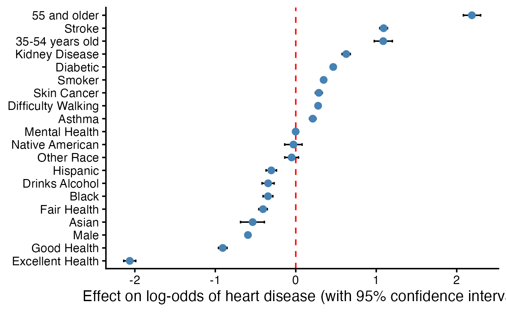

```{r}
library(tidyverse)
library(bestglm)
library(tidyr)
library(broom)
library(modelr)   # For generating prediction grids
library(scales)   # For better axis labels
```

## Motivation & Research Question 💟 {.smaller}

Cardiovascular disease (CVD) results from the cumulative and reinforcing
effects of biological, behavioral, and lifestyle factors over time.

-   How do demographic factors and health factors impact the probability
    that an individual will experience a heart attack?
-   We will examine **race, sex, age, smoking, drinking, diabetes,
    asthma, kidney disease, skin cancer, stroke,** and **general
    health** as predictors.
-   **Data Source:** Indicators of Heart Disease (2022) from Kaggle

. . .

> "The first wealth is health." — Ralph Waldo Emerson

------------------------------------------------------------------------

## Data Source & Collection

:::::: columns
::: {.column width="60%"}
-   **Dataset:** `heart_disease` (Indicators of Heart Disease)
-   **Source:** 2022 Centers for Disease Control and Prevention (CDC)
    from Kaggle
-   **Sample Size:** $n = 319795$ individuals
-   **Variables:** 18 aspects of demographics, behaviors, and health
    condition
:::

:::: {.column width="40%"}
::: callout-tip
## Why this data?

It is a large and strong dataset to observe how demographics and
lifestyle collide to drive the risk of heart disease.
:::
::::
::::::

------------------------------------------------------------------------

## Data Source & Collection

::::::: columns
:::: {.column width="60%"}
::: nonincremental
-   **Dataset:** `heart_disease` (Indicators of Heart Disease)
-   **Source:** 2022 Centers for Disease Control and Prevention (CDC)
    from Kaggle
-   **Sample Size:** $n = 319795$ individuals
-   **Variables:** 18 aspects of demographics, behaviors, and health
    condition
:::
::::

:::: {.column width="40%"}
::: callout-warning
## A Note on Self-Reporting

As some responses from this survey data are self-reported, variables
like `general_health` may be subject to bias, though the massive $n$
helps stabilize these trends.
:::
::::
:::::::

------------------------------------------------------------------------

## Highlights from EDA

```{r}
#| include: false
# load data
heartdisease <- readRDS("../disease_data/disease-prepared.RDS")
summary(heartdisease) # only 1 numeric variable
```

::: {.fragment .current-visible style="position:absolute; top:20%; left:5%; width:100%;"}
```{r}
#| echo: false

# RACE
ggplot(data = heartdisease, aes(x = factor(heart_disease), fill = race)) +
  geom_bar(color = "black", position = "fill") + 
  labs(x = "Heart Disease Status",
       y = "Count",
       fill = "Race") +
  scale_x_discrete(labels = c("0" = "No Heart Disease",
                              "1" = "Heart Disease")) +
  scale_fill_manual(values = c(
    "White" = "antiquewhite",
    "American Indian/Alaskan Native" = "tomato",
    "Asian" = "skyblue",
    "Black" = "orange",
    "Hispanic" = "darkolivegreen3",
    "Other" = "plum"),
    labels = c(
      "American Indian/Alaskan Native" = "Native American"
      )
    ) +
  theme_classic() + 
  theme(legend.position = "bottom")
```
:::

::: {.fragment .current-visible style="position:absolute; top:20%; left:5%; width:100%;"}
```{r}
#| echo: false
# AGE
heartdisease <- heartdisease %>% 
  mutate(age_category = case_when(
    age_category %in% c("18-24", "25-29", "30-34") ~ "18-34",
    age_category %in% c("35-39", "40-44", "45-49", "50-54") ~ "35-54",
    age_category %in% c("55-59", "60-64", "65-69", "70-74", "75-79", "80 or older") ~ "55 and older"
  ))

ggplot(data = heartdisease, aes(x = factor(heart_disease), fill = factor(age_category))) +
  geom_bar(color = "black", position = "fill") + 
  labs(x = "Heart Disease",
       y = "Count",
       fill = "Age Group") +
  scale_x_discrete(labels = c("0" = "No Heart Disease",
                              "1" = "Heart Disease")) +
  #scale_fill_manual(
  #  values = c("1" = "orange", "2" = "tomato", "3" = "skyblue"),
   # labels = c("18-34", "35-54", "55 and older")) +
  theme_classic() + 
  theme(legend.position = "bottom")


```
:::

::: {.fragment .current-visible style="position:absolute; top:20%; left:5%; width:100%;"}
```{r}
#| echo: false

# STROKE
ggplot(data = heartdisease, aes(x = factor(heart_disease), fill = factor(stroke))) +
  geom_bar(color = "black", position = "fill") + 
  labs(x = "Heart Disease Status",
       y = "Count",
       fill = "Stroke") +
  scale_x_discrete(labels = c("0" = "No Heart Disease",
                              "1" = "Heart Disease")) +
  scale_fill_manual(
    values = c("0" = "skyblue", "1" = "tomato"),
    labels = c("No", "Yes")
  ) +
  theme_classic() + 
  theme(legend.position = "bottom")
```
:::

------------------------------------------------------------------------

## Logistic Regression Model {.smaller}

$$log(Odds_{i}) = \beta_0 + \beta_1Smoking_i + \beta_2Alcohol_i + \beta_3Stroke_i + \\
\beta_3MentalHealth_i + \beta_4DiffWalking_i + \beta_5Sex_i + \\
\beta_6Over55_i + \beta_7Asian_i + \beta_8Black_i + \beta_9Hispanic_i + \\
\beta_{10}Diabetic_i + \beta_{11}HealthFair_i + \beta_{12}HealthGood_i + \\
\beta_{13}HealthExcellent_i + \beta_{14}Asthma_i + \beta_{15}KidneyDisease_i + \\
\beta_{16}SkinCancer_i$$

::: callout-note
## Model Selection

Best subset, forward, and backward selection all converged on the same
predictors for heart disease, optimizing for BIC.
:::

------------------------------------------------------------------------

## Logistic Regression Model {.smaller}

$$log(Odds_{i}) = \beta_0 + \beta_1Smoking_i + \beta_2Alcohol_i + \beta_3Stroke_i + \\
\beta_3MentalHealth_i + \beta_4DiffWalking_i + \beta_5Sex_i + \\
\beta_6Over55_i + \beta_7Asian_i + \beta_8Black_i + \beta_9Hispanic_i + \\
\beta_{10}Diabetic_i + \beta_{11}HealthFair_i + \beta_{12}HealthGood_i + \\
\beta_{13}HealthExcellent_i + \beta_{14}Asthma_i + \beta_{15}KidneyDisease_i + \\
\beta_{16}SkinCancer_i$$

::: callout-warning
## Model Assumptions

*Caution!* The dataset exhibits a class imbalance for the number of
individuals with vs without heart disease (less than 10% have heart
disease)! All other logistic regression assumptions were satisfied.
:::

## Key Predictors of Heart Attack Risk

:::::: columns
::: {.column width="70%"}

:::

:::{.column width = "30%"}

::: {.fragment style="font-size: 0.7em;"}
**Greatest contributors to risk of heart disease:**

-   55+ years old

-   Had a stroke

-   35-54 years old
:::

::: {.fragment style="font-size: 0.7em;"}
**Lowest risk of heart disease:**

-   Excellent/good general health

-   Male

-   Asian
:::
::::::

::::::

# Thank you! {background-color="#FFE3EB"}

Questions?

## Helpful Resources 📚

-   [**Official Revealjs
    Guide**](https://quarto.org/docs/presentations/revealjs/): The
    "Source of Truth" for all slide features.

-   [**Quarto
    Gallery**](https://quarto.org/docs/gallery/#presentations): Examples
    of award-winning presentations.

-   [**Slide
    Customization**](https://quarto.org/docs/presentations/revealjs/themes.html):
    Learn how to change colors, fonts, and backgrounds
